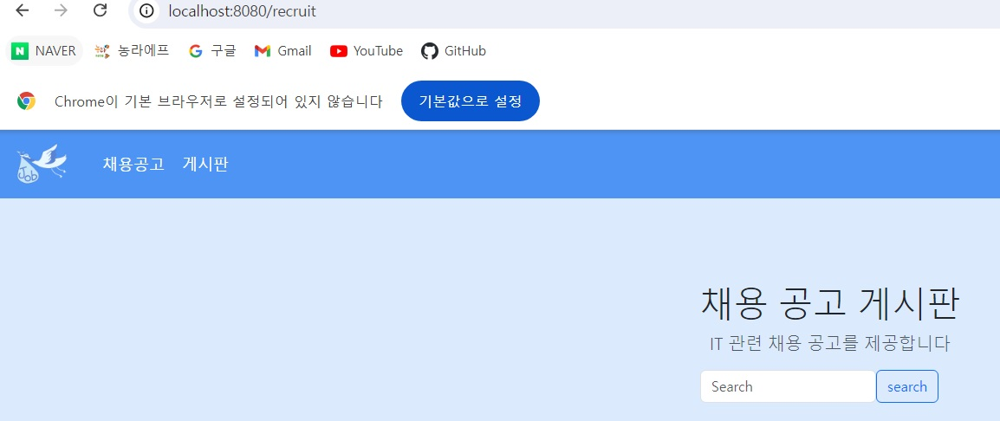
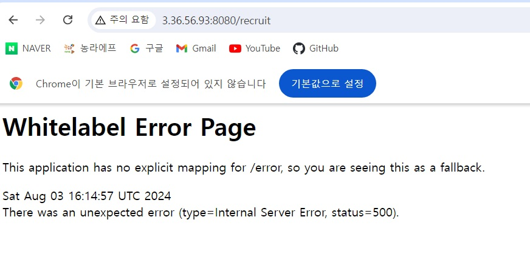

# 배포 에러

## 문제 상황

- 팀프로젝트로 작성한 코드를 배포하는 과정에서 생긴 문제.
- 문제상황 : EC2에서 배포 성공 후 브라우저로 접속해보니 500에러가 뜬다. 하지만 로컬에서 실행해보니 모든 페이지가 정상으로 뜬다.

로컬



EC2  서버 에러



## 에러 확인

### 런타임에러

빌드시 아무 문제 없었지만 실행도중 에러가 발생하였다. 

런타임 에러를 확인하기 위해 서버에서 spring을 띄웠다. 


사이트에 접속하자 에러를 확인할 수 있었다. 


- 에러내용

```java
2024-08-03T14:27:10.548Z ERROR 3232 --- [crane] [nio-8080-exec-2] org.thymeleaf.TemplateEngine             : [THYMELEAF][http-nio-8080-exec-2] Exception processing template "post/list": An error happened during template parsing (template: "class path resource [templates/post/list.html]")

org.thymeleaf.exceptions.TemplateInputException: An error happened during template parsing (template: "class path resource [templates/post/list.html]")
        at org.thymeleaf.templateparser.markup.AbstractMarkupTemplateParser.parse(AbstractMarkupTemplateParser.java:241) ~[thymeleaf-3.1.2.RELEASE.jar!/:3.1.2.RELEASE]
        at org.thymeleaf.templateparser.markup.AbstractMarkupTemplateParser.parseStandalone(AbstractMarkupTemplateParser.java:100) ~[thymeleaf-3.1.2.RELEASE.jar!/:3.1.2.RELEASE]
        
        
2024-08-03T14:27:10.561Z ERROR 3232 --- [crane] [nio-8080-exec-2] o.a.c.c.C.[.[.[/].[dispatcherServlet]    : Servlet.service() for servlet [dispatcherServlet] in context with path [] threw exception [Request processing failed: org.thymeleaf.exceptions.TemplateInputException: An error happened during template parsing (template: "class path resource [templates/post/list.html]")] with root cause

        
```

- html의 타임리프쪽 문제임을 파악했다.

## 해결

FE 하시는 분이 html 파일에 네비게이션 fragment를 달았다. 

해당 header.html 경로를 찾지 못한다. 경로 문제였다.

AS-IS : /layout/header.html
TO-BE : layout/header.html

**로컬에서의 경로랑 서버에서 jar로 배포된 경우랑 경로 인식이 달라서 그랬다.**

**슬래시 사용하면 jar로 배포된 경우 경로를 인식하지 못한다.**

- 이전 경로 설정


- 경로 수정


---

참고

[[Thymeleaf Error] EC2 배포 후 500 Error 발생. Local에서는 돼요.](https://chordplaylist.tistory.com/273)
